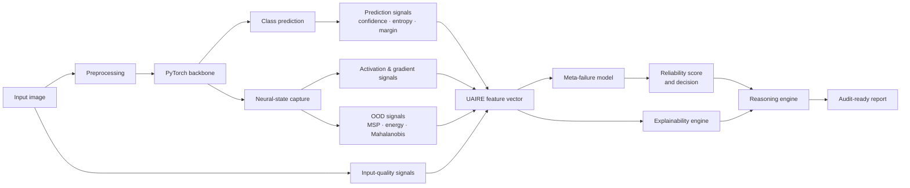
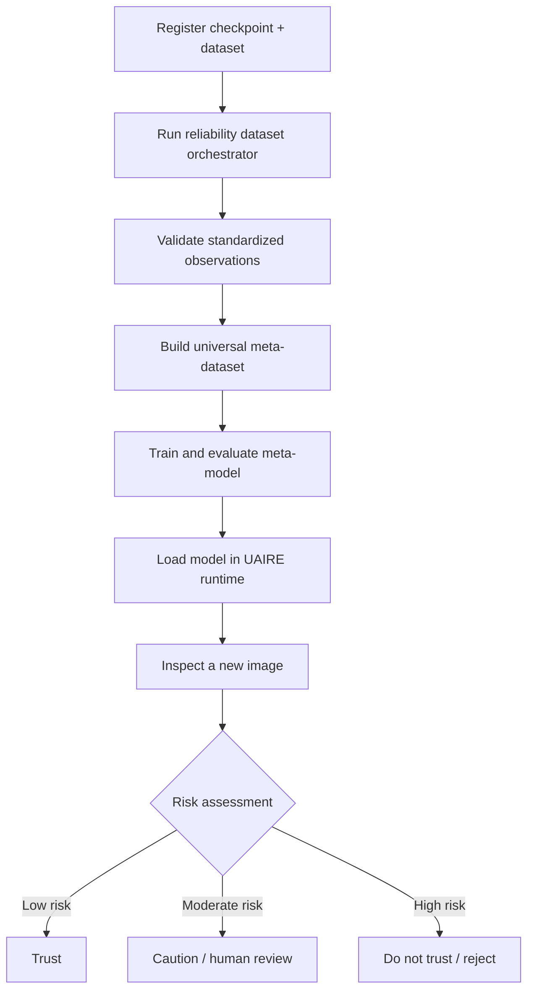
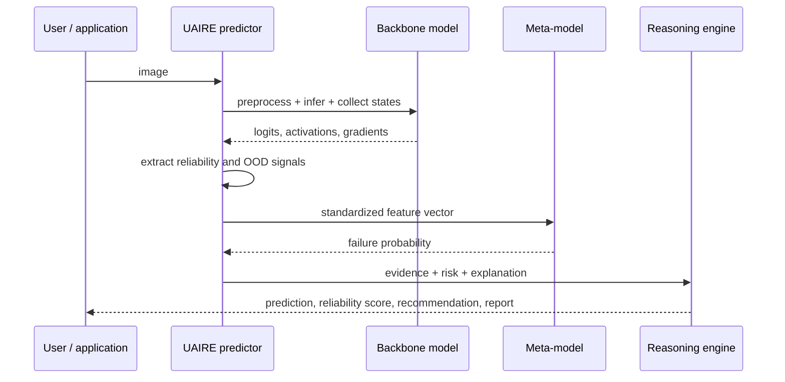
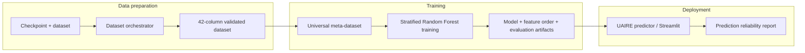
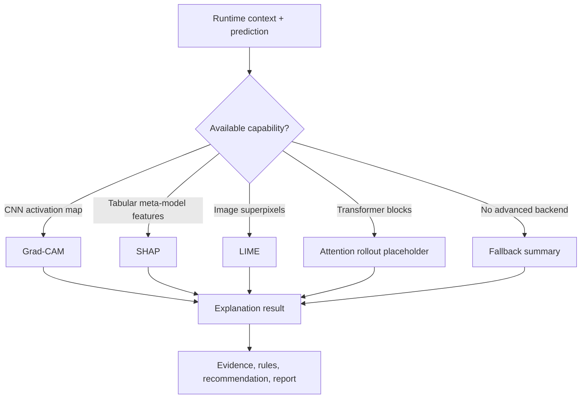

# UAIRE — Universal AI Reliability Engine

> **Estimate whether a model prediction deserves to be trusted — before it is acted upon.**

UAIRE is a research-oriented reliability layer for computer-vision models. It augments a base PyTorch classifier with confidence, neural-state, input-quality, and out-of-distribution (OOD) signals, then uses a meta-model to estimate prediction-failure risk and produce a human-readable recommendation.

```text
Image → Base-model prediction → Reliability evidence → Failure-risk estimate → Trust decision
```

## Why UAIRE?

High softmax confidence is not the same as reliability. UAIRE combines independent evidence about a prediction so that a downstream user can see not only *what* a model predicted, but also whether the prediction should be trusted, reviewed, or rejected.

| UAIRE capability | What it contributes |
| --- | --- |
| **Reliability signal extraction** | Confidence, activation health, gradient stability, image quality, and OOD features |
| **Meta-failure prediction** | A learned probability that the base prediction is incorrect |
| **Universal data workflow** | A standardized schema for collecting observations across supported datasets and backbones |
| **Architecture-aware runtime** | Model inspection, preprocessing selection, and feature-hook selection |
| **Explainability and reasoning** | Grad-CAM, LIME, SHAP, fallback explanations, deterministic rules, and recommendations |
| **Interactive dashboard** | A Streamlit interface for inspecting predictions, signals, OOD cues, and explanations |

## System architecture



## End-to-end workflow



## Reliability decision path



## Supported research workflow

The dataset workflow currently supports CIFAR-10, CIFAR-100, and Fashion-MNIST with registered ResNet-18, ResNet-34, MobileNetV2, EfficientNet-B0, and ViT-B/16 combinations where compatible checkpoints are available. The runtime and model registry are designed to be extended to additional torchvision-style CNNs and transformer families.



## Quick start

### 1. Clone and create an environment

```bash
git clone https://github.com/omdangi2007/generalized-meta-failure-predictor.git
cd generalized-meta-failure-predictor

python -m venv .venv
source .venv/bin/activate        # Windows: .venv\Scripts\activate
python -m pip install --upgrade pip
python -m pip install torch torchvision streamlit numpy pandas pillow \
  scikit-learn matplotlib plotly scikit-image joblib tqdm pyyaml shap
```

### 2. Provide local artifacts

Model checkpoints, raw datasets, generated results, and virtual environments are intentionally excluded from Git. Place the required checkpoints under `models/` and datasets under `data/`, following the paths in the example configuration files.

### 3. Launch the dashboard

```bash
streamlit run app/streamlit_app.py
```

### 4. Generate a reliability dataset (smoke test)

```bash
python -m src.dataset_orchestration configs/reliability_dataset.example.yaml
```

The example is configured for a small CPU run. Adjust `checkpoint`, `data_dir`, `device`, and `max_samples` before a full experiment.

## Programmatic usage

```python
from src.inference.predictor import UAIREPredictor
from src.models.model_loader import load_resnet18_cifar10

model = load_resnet18_cifar10(device="cpu")
predictor = UAIREPredictor(model=model, device="cpu")

report = predictor.predict("path/to/image.png")
print(report["prediction"])
print(report["reliability"])
```

For architecture-aware loading and runtime inspection:

```python
from src.model_registry import load_model

loaded = load_model("models/resnet18_cifar10.pth")
print(loaded.runtime_context.metadata.architecture_family)
```

## Core modules

| Module | Responsibility |
| --- | --- |
| `src/adapters/` | Bridges arbitrary PyTorch models to the UAIRE pipeline |
| `src/signal_extractors/` | Extracts prediction, activation, gradient, and image-quality features |
| `src/ood/` | MSP, energy, feature-distance, and Mahalanobis OOD detectors |
| `src/core/` | Coordinates feature extraction and signal registration |
| `src/inference/` | Runs failure prediction, scoring, explanations, and report generation |
| `src/runtime/` | Inspects models and creates immutable architecture-aware runtime contexts |
| `src/model_registry/` | Safely reconstructs and validates supported checkpoints |
| `src/dataset_orchestration/` | Produces reproducible, validated per-run reliability datasets |
| `src/meta_dataset/` | Merges compatible runs into one universal research dataset |
| `src/meta_model_training/` | Trains and evaluates the generalized failure-prediction model |
| `src/explainability/` | Automatically selects Grad-CAM, LIME, SHAP, attention-rollout, or fallback output |
| `src/reasoning_engine/` | Turns evidence into deterministic conclusions and trust recommendations |
| `app/` | Streamlit reliability dashboard |

## Data and model pipeline

UAIRE retains a fixed, validated feature schema across all orchestrated experiments. Each row includes run metadata, prediction and ground-truth labels, a binary failure label, and UAIRE reliability features. This makes experiments reproducible and enables training a single meta-model across compatible architectures and datasets.

```bash
# Build all available registered source datasets and merge them
python -m src.meta_dataset configs/universal_meta_dataset.example.yaml

# Train the generalized meta-failure model
python -m src.meta_model_training configs/universal_meta_model.example.yaml
```

Typical generated artifacts are written under `results/`:

```text
results/
├── reliability_datasets/<run>/    # CSV, manifests, and validation report
├── meta_dataset/                  # merged data, quality report, plots
└── meta_model/                    # model, feature order, metrics, plots, explanations
```

## Explainability and reasoning

The explanation engine chooses a method from runtime capabilities and available data instead of requiring the caller to pick a model-specific explainer.



Recommendations are derived from deterministic evidence rules and currently include **Trust**, **Caution**, **Needs Human Review**, **Do Not Trust**, and **Reject Prediction**.

## Repository layout

```text
MetaFailurePredictor/
├── app/                     # Streamlit application and presentation components
├── configs/                 # Reproducible example experiment configurations
├── notebooks/               # Exploration, validation, and training notebooks
├── src/                     # UAIRE library source code
│   ├── dataset_orchestration/
│   ├── explainability/
│   ├── meta_dataset/
│   ├── meta_model_training/
│   ├── model_registry/
│   ├── reasoning_engine/
│   └── runtime/
├── models/                  # Local checkpoints and meta-model artifacts (ignored)
├── data/                    # Local dataset files (ignored)
└── results/                 # Generated experiment artifacts (ignored)
```

## Design principles

- **Model-agnostic by design:** integrate reliability assessment alongside a model rather than modifying its training loop.
- **Evidence over confidence alone:** use complementary signals so a single confident softmax output does not dictate trust.
- **Reproducibility first:** configurations, manifests, hashes, and validation reports accompany generated datasets.
- **Safe extensibility:** registries provide boundaries for adding architectures, datasets, OOD methods, extractors, and reasoning rules.
- **Human-centered output:** provide an explicit recommendation and supporting evidence, not just a score.

## Documentation

- [Research specification](RESEARCH_SPECIFICATION.md)
- [Runtime engine](RUNTIME_ENGINE.md)
- [Model registry](MODEL_REGISTRY.md)
- [Dataset orchestrator](DATASET_ORCHESTRATOR.md)
- [Universal meta-dataset](UNIVERSAL_META_DATASET.md)
- [Universal meta-model training](UNIVERSAL_META_MODEL.md)
- [Explainability engine](EXPLAINABILITY_ENGINE.md)
- [Reasoning engine](REASONING_ENGINE.md)
- [Reliability signal registry](Reliability_Signal_Registry.md)

## Limitations

UAIRE is a research prototype and a reliability estimate is not a guarantee of correctness. The model registry supports common registered architectures rather than every possible third-party topology; checkpoint metadata recovery is best effort; and advanced explainers depend on the compatible runtime and installed dependencies. Validate the framework thoroughly for the intended domain before using it in high-stakes decisions.

## Author

**Om V. Dangi**

---

Built to make AI predictions more transparent, auditable, and worthy of trust.
